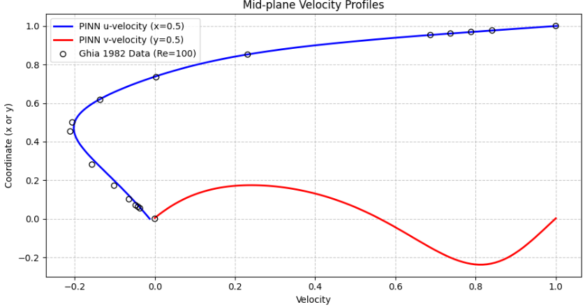

# Physics-Informed Neural Network (PINN) for 2D Lid-Driven Cavity Flow

## Overview
This repository contains a purely mesh-free, data-independent forward solver for the steady-state 2D incompressible Navier-Stokes equations using a Physics-Informed Neural Network (PINN). The model simulates the canonical lid-driven cavity flow at a Reynolds number of 100 ($Re = 100$) and is rigorously validated against discrete numerical benchmark data, provided by Ghia (1982).

## Methodology & Architecture
Unlike traditional finite-volume CFD solvers, this approach eliminates the need for spatial discretization (meshing). Instead, a deep fully connected Multilayer Perceptron (MLP) acts as a universal function approximator. It basically maps continuous spatial coordinates to flow variables: $(x, y) \rightarrow (u, v, p)$.

* **Network Depth & Activation:** The architecture utilizes a deep hidden-layer structure with `Tanh` activation functions to ensure continuous, non-zero second-order spatial derivatives required for calculating viscous diffusion.
* **Physics-Informed Loss Landscape:** The loss function is a composite of the boundary condition penalties ($L_{BC}$) and the partial differential equation residuals ($L_{PDE}$).
* **Two-Stage Optimization:** To overcome gradient pathology and avoid convergence to trivial interpolations, the network employs a two-stage training loop:
  1. **Adam Optimizer:** Used for early-stage broad boundary mapping.
  2. **L-BFGS Optimizer:** A second-order quasi-Newton method applied in the final stages to automatically scale step sizes based on Hessian curvature, aggressively driving the complex PDE residuals to near-zero.

## Governing Equations
The physical constraints enforced within the network's loss function are the steady-state, incompressible Navier-Stokes equations:

**Continuity (Mass Conservation):**
$$ \frac{\partial u}{\partial x} + \frac{\partial v}{\partial y} = 0 $$

**X-Momentum:**
$$ u\frac{\partial u}{\partial x} + v\frac{\partial u}{\partial y} + \frac{\partial p}{\partial x} - \frac{1}{Re} \left( \frac{\partial^2 u}{\partial x^2} + \frac{\partial^2 u}{\partial y^2} \right) = 0 $$

**Y-Momentum:**
$$ u\frac{\partial v}{\partial x} + v\frac{\partial v}{\partial y} + \frac{\partial p}{\partial y} - \frac{1}{Re} \left( \frac{\partial^2 v}{\partial x^2} + \frac{\partial^2 v}{\partial y^2} \right) = 0 $$

## Validation & Results
The continuous velocity predictions extracted from the PINN were benchmarked against the foundational 1982 numerical study by Ghia et al. 

* **Left (Velocity Field & Streamlines):** The network successfully resolves the primary central recirculation zone without any internal training data.
* **Center (Pressure Contour):** The static pressure field properly captures the high-pressure stagnation region at the top-right corner.
* **Right (Mid-Plane Velocity Profiles):** The continuous PINN $u$-velocity and $v$-velocity extractions (solid lines) pass directly through the discrete Ghia 1982 reference points (open circles), mathematically validating the physical accuracy of the neural surrogate.

## Repository Structure
* `pinn_solver.py`: The main PyTorch training script, including network architecture, analytical gradient computation, and plotting logic.
* `ghia_1982_benchmark.csv`: The extracted centerline velocity reference data used for validation.
* `cavity_results.png`: The output dashboard visualizing the converged fluid state.

## How to Run
Ensure you have PyTorch, NumPy, and Matplotlib installed. 
Run the solver via terminal:
`python pinn_solver.py`

*(Note: Depending on hardware, the L-BFGS optimization phase may take a few minutes to converge).*
